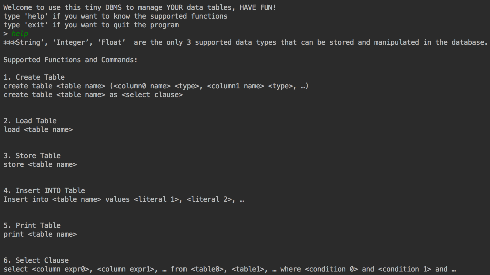
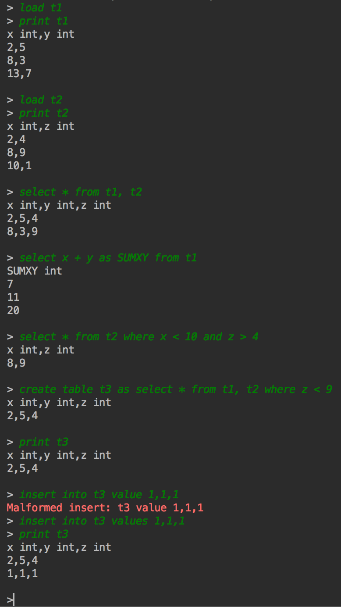

# Database

A small version of relational database management system with standard functions are implemented in this project by using Java.
It's project 2 from 2017 Berkley's CS61B Data Structure class.

## Fork it and Try it out if you are interested!

Built it in IntelliJ. You could simply pull it or download it and then import it into IntelliJ.
You need to import princeton standard library.
All of the stored tables are stored in folder examples.(with a extension .tbl).

## Supported Commands

*  *Create Table*
*  *Load Table*
*  *Store Table*
*  *Drop Table*
*  *Print Table*
*  *Select Columns from Table* with supported simple arithmetic operations.

## Examples

Some of the examples of how to interact with this database is shown below. User can type command lines following the '> ' sign.
Program can be terminated or closed by typing the command 'exit'. For help on supported functions, user can type 'help' to know more about that information.

